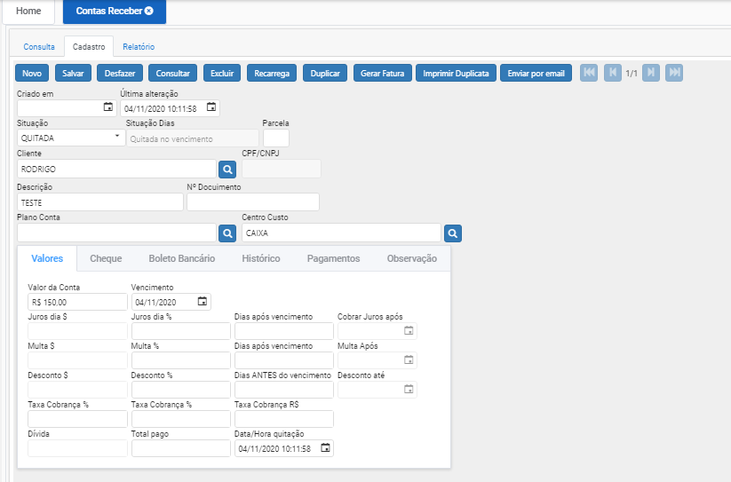

# Contas a Receber

**Contas a receber são os tipos de contas registradas como entradas e baixas das vendas. Ou seja, elas correspondem ao dinheiro que vai entrar no seu fluxo de caixa em decorrência da venda de um produto ou contratação de um serviço.**

Clicando em “NOVO” irá direcionar para aba cadastro com os campos em branco para serem preenchidos;

Aba de cadastro:

Ao clicar em “Novo” o sistema automaticamente inclui data e hora da criação do registro, com a situação PENDENTE, podemos informar numero de parcelas caso seja mais de um titulo.

Próximo passo é escolher um CLIENTE, clicamos na lupa selecionamos, retornando para o registro do titulo.

Inserimos a DESCRIÇÃO do titulo ou numero de documento caso tenha.

Plano de contas – informa o tipo do titulo (salario, despesas, 13° e etc..)

Centro de Custo – indicara onde dinheiro irá entrar no recebimento desse titulo (Caixa, banco e etc…).

Próximo passo informar o valor da conta e vencimento.

Podemos definir juros em dias ou %(porcentagem) e quando iniciar a cobrança do mesmo.

Caso haja desconto pagando antecipado, também podemos definir no registro.

Após incluir as informações nos campos, clicar em “Salvar”, o sistema irá adicionar esse registro no banco de dados, concluindo o cadastro.

Caso deseje iniciar outro cadastro basta clicar novamente em “Novo”.

Caso deseje alterar um cadastro, basta clicar 2x (duas vezes) no registo mostrado na tela consulta, após alterar as informações clicar em “salvar”.

Caso deseje Excluir um cadastro, basta clicar 2x (duas vezes) no registo mostrado na tela consulta, após ele entrar no registro, clicar no botão “EXCLUIR”
