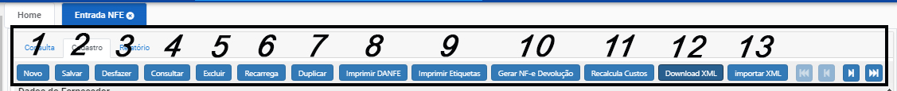
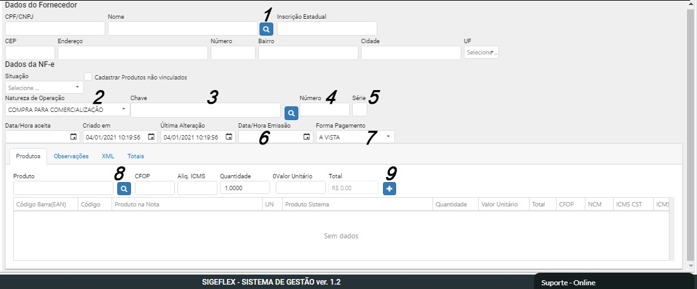
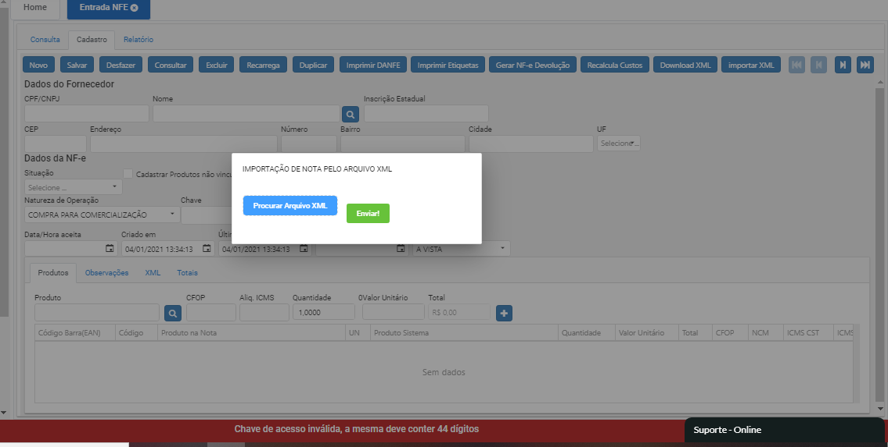
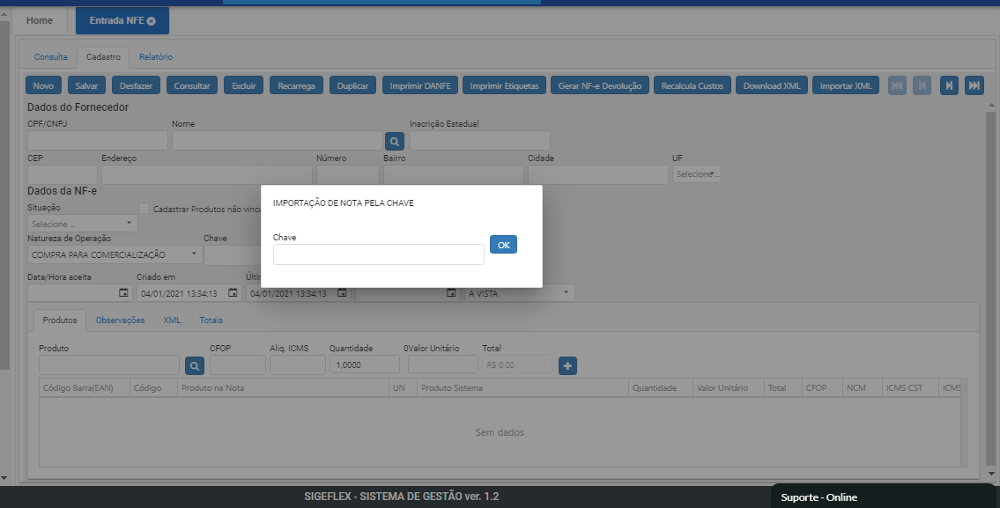

# NF-e Entrada

O sistema dispoem de 3 formas para realizar o procedimento de entrada de mercadoria:

1 Verificação automática.

2 Manualmente.

3 Importação da XML (arquivo ou chave da nota)

1 - Logo que abrimos a tela de NF-e Entrada, vemos disponivel a opção de "Verificar NFE Pendente".

.png>)

O sistema verifica na SEFAZ se existe alguma nfe que fo emitida para o CNPJ do solicitante da busca, caso nao tenha realizado entrada, o sistema faz o download da nota, entramos na nota baixada, para realizar a conferência dos campos e dos itens.

Após realizar a verificação, e todos os dados estejam corretos, mudar a "Situação" da nota para "Aceita". O sistema irá dar entrada nos itens e quantidades.

OBS: esta função só funciona caso a nota esteja diponível, os documentos fiscais eletrônicos ficaram disponíveis por até 3 (três) meses após terem sido recebidos no Ambiente Nacional da NF-e.

2 - Entrada de Nota Manualmente.

Clicar no botão "Novo"

BOTÕES

1 NOVO

(Inicia um novo registro)

2 SALVAR

(Salvar alterações realizadas no registro)

3 DESFAZER

(Desfaz edições realizadas)

4 CONSULTAR

(Consulta registro já realizado)

5 EXCLUIR

(Excluir registro)

6 RECARREGA

(Atualizar dados do registro)

7 DUPLICAR

(Duplicar registro já salvo)

8 IMPRIMIR DANFE

(Imprimir)

9 IMPRIMIR ETIQUETAS

(Imprimir etiquetas dos produtos que constam na NFE)

10 GERAR NFE DEVOLUÇÃO

(Cria automaticamente uma nota de devolução baseada na de entrada)

11 RECALCULAR CUSTOS

(Dentro de cada iten da nota tem um campo de "custo da mercadoria" que ele calcula, esse botao serve para forçar o recalculo dos custos de cada item)

12 DOWNLOAD XML

(Após a entrada e a nota ser salva função disponibiliza o xml)

13 IMPORTAR XML

(Importação pela Chave e pelo arquivo XML)

CORPO DA NOTA

1 Clicar na lupa para escolher o FORNECEDOR da nota onde o mesmo irá puxar os dados de cadastro e endereço.

2 NATUREZA DA OPERAÇÃO (informar qual o tipo da entrada dos itens relacionados nesta nota) OBS: notas de uso e consumo não entra no estoque.

3 CHAVE (incluir a chave da nota).

4 NUMERO DA NOTA

5 SERIE DA NOTA

6 DATA /HORA EMISSÃO

7 FORMA DE PAGAMENTO

8 PESQUISAR PRODUTO (Incluir produto)

9 INCLUIR PRODUTO OU ASSOCIAR O ITEN A CADASTRO JA REALIZADO.

Após incluir todos os dados clicar no Botão SALVAR.

Alterar o Status da nota para ACEITA.

**Importação da XML**

Após abrir entrada de NF-e clica no botão Importar XML.

Logo vai escolher se vai realizar a importação pela CHAVE ou ARQUIVO XML.

Em ambos os processos, após realizar importação, realizar conferência dos itens e salvar a nota, então alterar a situação para ACEITA.

Atualização dos dados do Produto

Ao aceitar a nota, é feito uma atualização dos campos dos produtos, como preço da última compra, preço de custo, custo do ipi, custo do frete, custo de outras despesas, custo da diferença de alíquota.

Se na nota tiver para atualizar o preço de venda e no produto nao, então a nota atualizará o preço de venda.

se a descrição do produto nao tiver preenchida, os sistema irá atualizar com a seguinte mensagem:

"Cadastrado a partir da NF de Entrada Nº XXX do fornecedor FORNECEDOR EXEMPLO."
