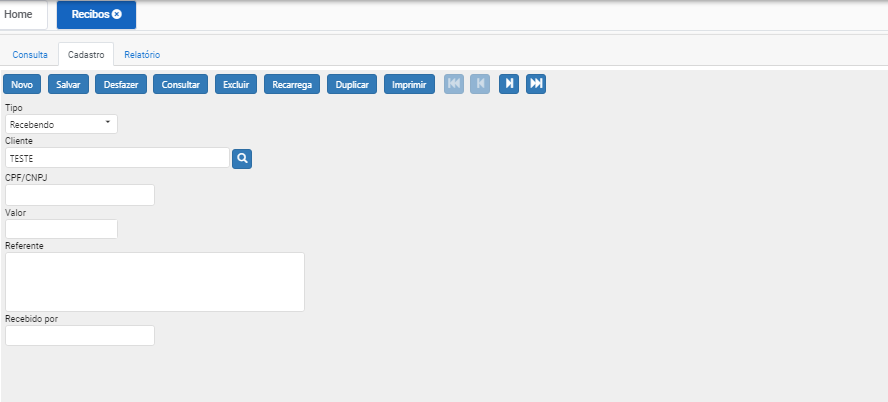

# Recibo

## Como emitir um recibo?

Clicando em “NOVO” irá direcionar para aba cadastro com os campos em branco para serem preenchidos;

Iremos escolher o tipo do recibo: Recebendo (cliente). Pagando (fornecedor).

Incluímos o CPF/CNPJ, valor do recibo e a informação de que é referente o mesmo.

Recebido por (nome de quem esta pagando).

Após incluir as informações nos campos, clicar em “Salvar”, o sistema irá adicionar esse registro no banco de dados, concluindo o cadastro.

Pode ser impresso para ser entregue.

Caso deseje iniciar outro cadastro basta clicar novamente em “Novo”.

Caso deseje alterar um cadastro, basta clicar 2x (duas vezes) no registo mostrado na tela consulta, após alterar as informações clicar em “salvar”.

Caso deseje Excluir um cadastro, basta clicar 2x (duas vezes) no registo mostrado na tela consulta, após ele entrar no registro, clicar no botão “EXCLUIR”.
