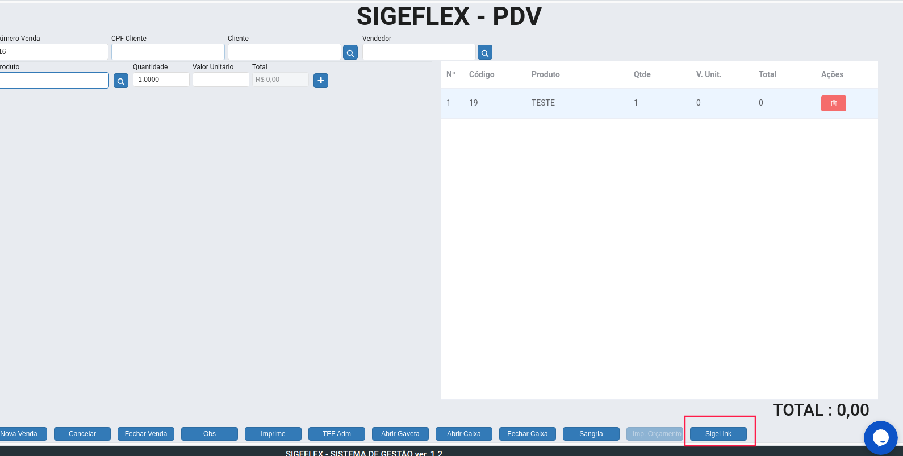

# Sigelink

O [Sigelink](https://www.dropbox.com/s/6ypcr13envlum0t/SigeflexLink.exe) é um aplicativo que serve de “ponte” entre sistemas, realizando comunicação.

No caso de TEF, permite a comunicacao do sistema Sigeflex com o programa do TEF gerenciando os arquivos do mesmo.

Balança, gaveta eletrônica ele permite a comunicação do sistema com o ACBr.

Para verificar se o mesmo está rodando basta abrir o navegador e digitir _**localhost:5000**_, ele vai mostrar a mensagem “Sigelink rodando”

Download do Sigelink

## Leia mais

[Cadastro de Pessoas](cadastro-de-pessoas.md)
