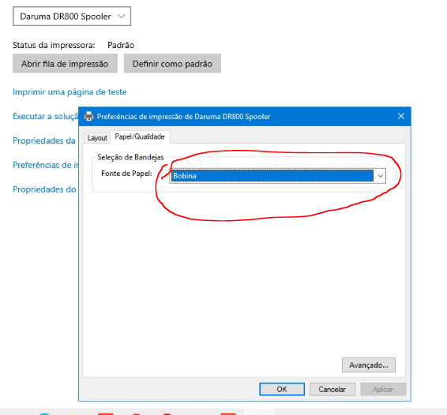
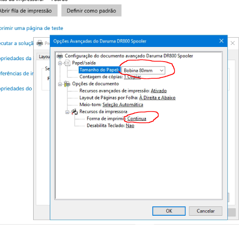

# Impressão do Danfe NFC-e ejeta muito papel

As vezes, ao mandar imprimir o Danfe da NFC-e pelo navegador, ejeta bastante papel no final, para resolver isso, basta configurar o driver da mesma.

## Passos

* Abra a configuração da impressora

* Fonte de papel, mude para **Bobina**

* Clique no botão "**Avançado..."** e deixe as configurações como mostra a tela abaixo

**Pronto**, agora ao imprimir o Danfe, nao irá mais ejetar muito papel no final
