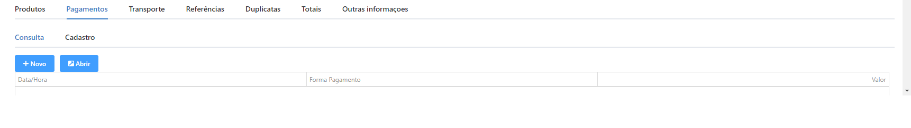

# NF-e

### Como realizar a emissão de uma Nota Fiscal Eletrônica?

No Sigeflex DF-e, entrar no menu NF-e, logo terá a tela de consulta, mostrando as notas já emitidas, seja ela autorizada, cancelada ou rejeitada.

.png>)

Clicar em NOVO, para iniciar um novo registro.

.png>)

Os campos em destaque vermelho, sao dados obrigatórios para emissão da NF-e.

* _**Selecionando destinatário**_
  * Para incluir o destinatário da nota (cliente ou fornecedor) em DADOS DO DESTINATÁRIO, ao clicar na lupa o sistema faz a busca dos registos
  *   Ao selecionar o registro o sistema traz do cadastro as informações necessárias para nota ser autorizada

      * CNPJ
      * DESTINATÁRIO
      * I.E (INSCRIÇÃO ESTADUAL)
      * ENDEREÇO COMPLETO (CEP, BAIRRO, RUA, NÚMERO, CIADE, CÓDIGO DA CIDADE E UF).
      * E-MAIL
      * TELEFONE

* I**nformações DADOS DA NOTA**:
  * SITUAÇÃO DA NOTA (Preenchimento automático).
  * NATUREZA DA OPERAÇÃO (informa se a nota é Compra para Comercialização, Uso e Consumo, Transferência ou Remessa).
  * VALOR TOTAL(calculado automaticamente pelo sisema)

#### **Produtos (inserir produtos na nota)**

A busca pode ser feita através da descrição ou código do item, logo após, inserimos o CFOP (Código Fiscal de Operação), na qual informa a finalidade da nota, a quantidade desejada e adicionamos o item, e repete o processo para quantos itens forem na nota.

.png>)

#### Transporte (OPCIONAL, dados do transportador, modo de frete)

Iinformar os dados do transportador. Escolhendo o MODO DE FRETE.

.png>)

Caso seja SEM FRETE(valor padrão), basta prosseguir para proxima aba, se for informado frete por, EMISSOR, DESTINATÁRIO OU TERCEIROS,  precisa informar os campos abaixo:

.png>)

* Nome do transportador (pode ser ralizado consulta);
* CPF do transportador;
* Inscrição Estadual;
* Endereço (rua);
* Cidade;
* UF;
* Placa do veiculo;
* UF do veiculo;
* RNTC (Registro Nacional de Transportadores Rodoviários de Carga);
* Quantidade;
* Espécie;
* Marca;
* Numeração;
* Peso líquido (calculado automaticamente pelo sistema baseado no cadastro dos produtos);
*   Peso Bruto (calculado automaticamente pelo sistema baseado no cadastro dos produtos).

    &#x20;.

#### Referência

Na aba de REFERÊNCIAS, incluir uma ou mais **chaves de notas**, caso seja nota de **devolução** ou **reimpressão de venda**, pode-se informar a qual nota se refere.

.png>)

#### Duplicata

Aba DUPLICATA consta as informações caso o pagamento da nota tenha sido realizado por via de boletos ou crediário, que pode ser controlados de forma externa (outro sistema) ou pelo [**Sigeflex Financeiro**](../../sigeflex-financeiro/).

.png>)

#### Totais da nota

Logo então temos a aba dos TOTAIS da nota, onde constam os valores de :

.png>)

* Subtotal;
* Outras despesas - Editavel;
* Frete - Editavel;
* Seguro - Editavel;
* Valor ICMS BC;
* Valor ICMS;
* Valor ICMS ST;
* Valor ICMS ST BC;
* Valor ICMS Inter. FCP;
* V. ICMS Inter. Origem;
* V. ICMS Inter. Destino;
* Valor PIS;
* Valor COFINS;
* Valor IPI;
* Valor de desconto - Editavel;
* Percentual de desconto - Editavel;
* Valor total;
* Total pago.

Obs: Todos os campos não editáveis são **calculados automaticamente pelo sistema**, somente os campos Outras Despesas, Frete, Seguro, Desconto(valor e percentual) o usuário pode entrar com valores que deseja.

#### Pagamentos (inserir pagamentos da nota)

Fica registrado os detalhes do pagamento daquela NF-e, caso não especifique, o sistema colocará como padrão a forma de pagamento DINHEIRO

.png>)

#### Outras informações

Por fim a aba de OUTRAS INFORMAÇÕES, onde temos as informações de:

.png>)

* SÉRIE (Produção ou Homologação);
* AMBIENTE (Produção ou Homologação);
* TIPO DE OPERAÇÃO (Entrada ou Saída);
* FORMA DE EMISSÃO (Normal ou em Contingência);
* FINALIDADE;
* DATA/HORA EMISSÃO
* DATA/HORA SAIDA
* Campo de Observações para informações adicionais.

#### Enviar Nota

Após realizar inclusão de todas as informações da nota, clicar no botao ENVIAR, onde o sistema irá realizar a comunicação com a SEFAZ que por sua vez, pode ou não AUTORIZAR O USO DA NF-e.

.png>)

CLICAR EM IMPRIMIR PARA GERA O DANFE

.png>)

