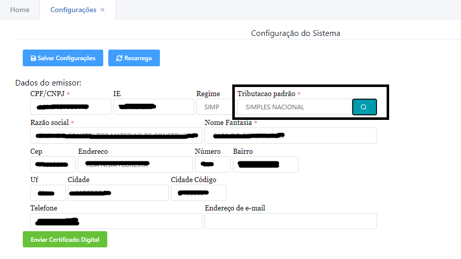

# Cálculo do Imposto

O sistema gera 2 tributações automática por padrão baseada no regime tributário da empresa(tanto para o **Simples Nacional** como para regime **Normal** e **Real**) e seu estado, colocando a alíquota correta de acordo com o estado que a empresa reside. Veja as telas abaixo

.png>)

.png>)

**ATENÇÃO! Confirme com sua contabilidade se os valores gerados estão corretos de acordo com a trib utação dos seus produtos, pois existem diversas variáções, esses registros gerados são os mais comuns de acordo com o regime tributário da empresa.**

## Como é definido a tributação nos produtos?

A ordem de busca por tributação dos produtos é:

* Busca se no produto tem tributação, se tiver, já usa a do produto
* Caso o produto não tenha e o produto tiver definido a categoria, busca tributação na categoria na qual o produto ta vinculado caso a categorai tenha uma tributação
* Em último caso, busca a tributação padrão definida na [tela de configuração](../configuracoesdfe.md)

### Tela onde define a tributação no produto

###

No cadastro do produto, na aba "Dados Fiscais", pode ser inserido a informação sobre t

.png>)

### Tela onde define a tributação pela categoria

Tambem criando uma categoria e informando os dados fiscais da mesma, pode ser usado em varios produtos que se enquadrem na mesma categoria

.png>)

### Tela onde define a tributação em configuração

Caso não sejam informados nestes locais o sistema pega a informação padrão no cadastro da empresa, na tela de configurações:

