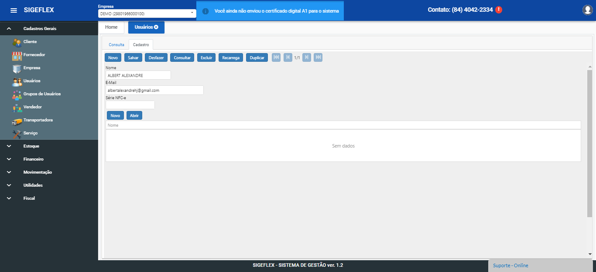

# Cadastro de Usuários

### **Como criar um cadastro de usuário?**

Clicando em “NOVO” irá direcionar para aba cadastro com os campos em branco para serem preenchidos;

Aba de cadastro:

Continuando na aba cadastro, serão mostrados os campos onde o usuário irá incluir os dados solicitados (nome e email).

Caso deseje que o usuário tenha acesso a emissão em outra série da NFC-e, incluir no campo “Série Nfc-e”

Após incluir as informações nos campos, clicar em “Salvar”, o sistema irá adicionar esse registro no banco de dados;

O sistema irá enviar um e-mail de confirmação e senha para o e-mail cadastrado!

Clicar no link para confirmar o cadastro e salvar a senha para acesso no sistema;

Concluindo esse procedimento volta para o cadastro de usuário e será possivel incluir o “grupo de usuários” onde insere as permissões que esse usuário terá no sistema;

clica no botão “novo” abaixo do campo"Série NFc-e"". Irá exibir um campo de busca, clica na lupa para pesquisar.

Consulta de Grupo de usuário:

seleciona na o grupo com 2 cliques, salva e volta para tela anterior pressionando “ESC”;

Após concluir a inclusão do grupo de usuários, clicar em “Salvar”,
