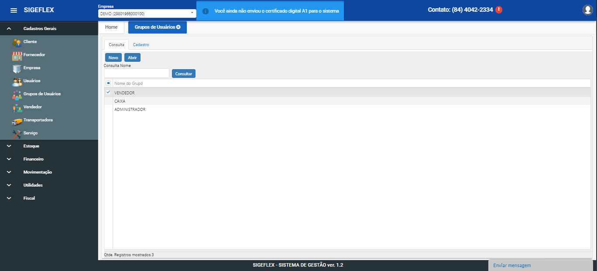

# Grupo de Usuário

Aba de consulta:

Clicando em “NOVO” irá direcionar para aba cadastro, onde irá cadastrar o nome do grupo;

Aba de cadastro:

Após incluir o nome do grupo, definiremos os acessos que sera permitido para esse determinado grupo;

Dentro de cada opção de permissão, selecione as que o grupo terá acesso:

Sendo elas “Incluir, Alterar, Excluir e Relatório;

•Cadastros Gerais

•Estoque

•Financeiro

•Movimentação

•Fiscal

Após selecionar as permissões, clique em “Salvar”;

Caso deseje iniciar outro cadastro basta clicar novamente em “Novo”.
