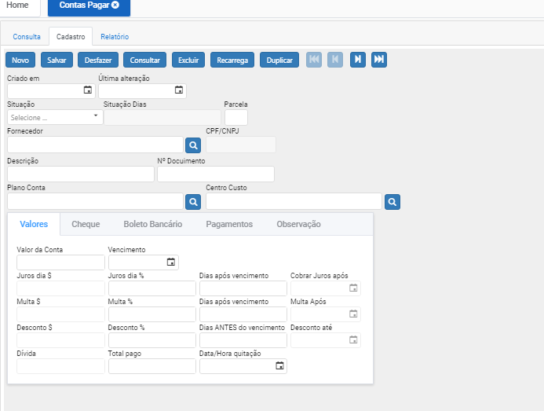

# Contas a Pagar

**Contas a pagar são basicamente as obrigações financeiras que a empresa assume com seus fornecedores, é um tipo de conta onde ficam registrados os compromissos financeiros a serem liquidados como fornecedores ou impostos.**

Clicando em “NOVO” irá direcionar para aba cadastro com os campos em branco para serem preenchidos;

Aba de cadastro:

Ao clicar em “Novo” o sistema automaticamente inclui data e hora da criação do registro, com a situação PENDENTE, podemos informar numero de parcelas caso seja mais de um titulo.

Próximo passo é escolher um FORNECEDOR, clicamos na lupa selecionamos, retornando para o registro do titulo. Podemos cadastrar funcionários para registrar folha de pagamento, conta de luz, internet, utilizando o financeiro do sistema para controle gerencial em sua empresa.

Inserimos a DESCRIÇÃO do titulo ou numero de documento caso tenha.

Plano de contas – informa o tipo do titulo (salario, despesas, 13° e etc..)

Centro de Custo – indica de onde o dinheiro esta saindo para pagamento dessa conta (Caixa, banco e etc…).

Próximo passo informar o valor da conta e vencimento.

Podemos definir juros em dias ou %(porcentagem) e quando iniciar a cobrança do mesmo.

Caso haja desconto pagando antecipado, também podemos definir no registro.

Após incluir as informações nos campos, clicar em “Salvar”, o sistema irá adicionar esse registro no banco de dados, concluindo o cadastro. Caso deseje iniciar outro cadastro basta clicar novamente em “Novo”.

Caso deseje alterar um cadastro, basta clicar 2x (duas vezes) no registo mostrado na tela consulta, após alterar as informações clicar em “salvar”.

Caso deseje Excluir um cadastro, basta clicar 2x (duas vezes) no registo mostrado na tela consulta, após ele entrar no registro, clicar no botão “EXCLUIR”
