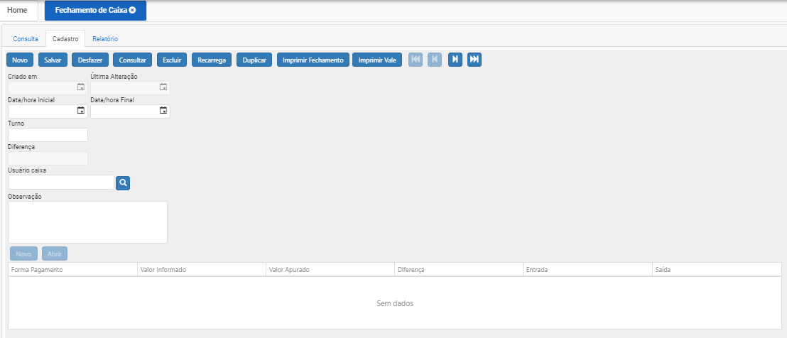

# Fechamento de Caixa

### **Como realizar um fechamento de caixa?**

Ao clicar em “Novo” o sistema automaticamente inclui data e hora da criação do registro.

Próximo passo é informar Data/Hora inicial e final (período para sistema buscar a movimentação).

Informamos o Turno (apenas números).

Usuário Caixa (usuário da movimentação do período informado).

Campo de observação caso necessário.

Após incluir as informações nos campos, clicar em “Salvar”, o sistema irá adicionar esse registro no banco de dados, concluindo o cadastro.

Caso deseje iniciar outro cadastro basta clicar novamente em “Novo”.

Caso deseje alterar um cadastro, basta clicar 2x (duas vezes) no registo mostrado na tela consulta, após alterar as informações clicar em “salvar”.

Caso deseje Excluir um cadastro, basta clicar 2x (duas vezes) no registo mostrado na tela consulta, após ele entrar no registro, clicar no botão “EXCLUIR”.
